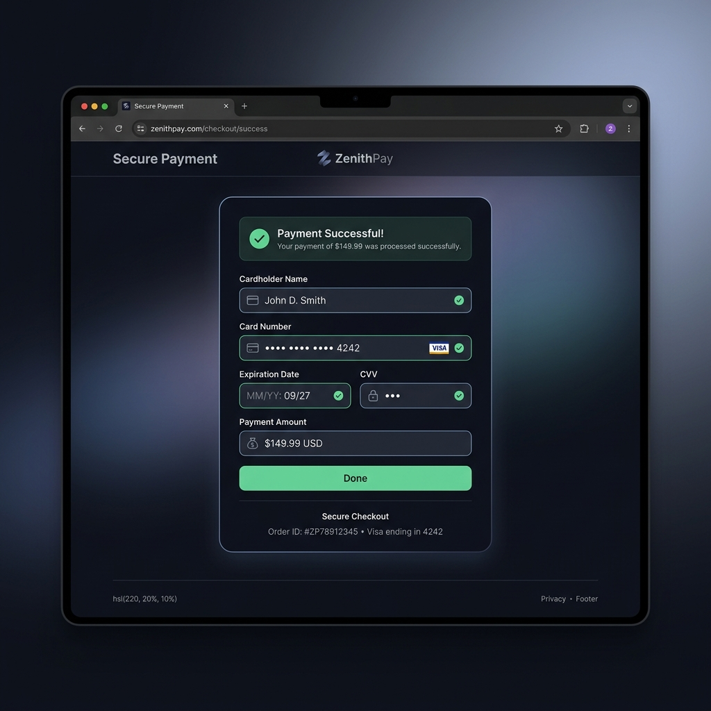

# Payment Action Project

A lightweight Spring Boot payment processing web application that validates card payments and runs on a CI/CD pipeline deploying directly to AWS EC2.



---

## 🛠️ Installation & Local Setup

### Prerequisites
*   **Java 17** (JDK 17)
*   **Maven 3.x**
*   **Docker** (Optional)

### Step-by-Step Setup

1.  **Clone the Repository**
    ```bash
    git clone https://github.com/guruduttvashishta2006/deployment.git
    cd deployment
    ```

2.  **Build the Project**
    Run the Maven build command:
    ```bash
    mvn clean install
    ```

3.  **Run the Server**
    Start the Spring Boot application locally:
    ```bash
    mvn spring-boot:run
    ```
    The application will start on port `8080` (accessible at `http://localhost:8080`).

---

## 💻 Usage Example

### Interactive UI
Open `http://localhost:8080` in your web browser to interact with the visual payment form.

### API Endpoint (`POST /api/payment`)
You can submit payment validation requests programmatically:

#### Request
```bash
curl -X POST http://localhost:8080/api/payment \
     -H "Content-Type: application/json" \
     -d '{
       "name": "Jane Doe",
       "cardNumber": "4111222233334444",
       "amount": 150.0
     }'
```

#### Response
*   `true` if the card starts with `'4'` (Visa) and passes basic validation constraints.
*   `false` otherwise.

---

## 🐳 Running with Docker
To compile and containerize the application:

```bash
# Build the Docker image
docker build -t payment-action .

# Start the container
docker run -d --name payment-action -p 8080:8080 payment-action
```

---

## 🚀 CI/CD Pipeline & EC2 Deployment
This project features a continuous integration and deployment pipeline configured in [.github/workflows/deploy.yml](.github/workflows/deploy.yml) that:
1. Compiles and runs unit tests on code push to the `main` branch.
2. Builds the Docker container, packaging it into a compressed tarball.
3. Securely copies the package to AWS EC2 over SCP.
4. Restarts the container on the target EC2 machine automatically.

For contributing guidelines, check out [CONTRIBUTING.md](CONTRIBUTING.md).
